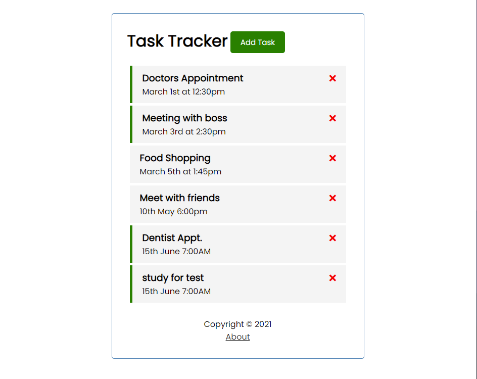
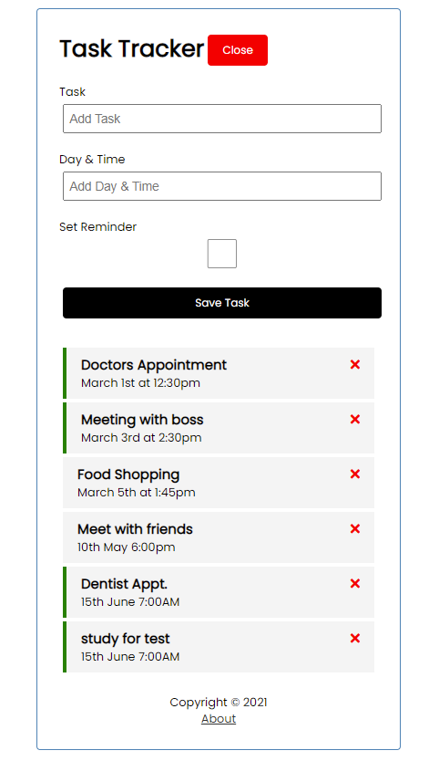

# Task Tracker - Vue.js

This project was completed following the [Vue JS Crash Course 2021 from Traversy Media on YouTube](https://www.youtube.com/watch?v=qZXt1Aom3Cs). This challenge allowed me to understand the fundamentals of Vue.js and help build my skills in creating dynamic frontend apps/websites.

## Table of contents

- [Overview](#overview)
  - [The challenge](#the-challenge)
  - [Screenshot](#screenshot-for-my-attempt)
  - [Links](#links)
- [My process](#my-process)
  - [Built with](#built-with)
  - [What I learned](#what-i-learned)
  - [Continued development](#continued-development)
- [Author](#author)
- [Project Setup](#projectsetup)

## Overview

### The challenge

Users should be able to:

- Add new tasks
  - Can add a date and time for the task
  - Can set reminder
- Can view tasks below the add task form
  - You can toggle set reminder by double clicking the task. A green bar will display on the side of the task component to demonstrate that the task has a reminder set
  - Can delete tasks by clicking the red cross button. This will permanently delete the task from the JSON file
- Can toggle 'add task' to hide or display the add task form

### Screenshot For My Attempt






### Links

- Solution URL: [View Solution](https://github.com/AbdulMiah/vue-task_tracker)


### Built with

- Vue.js
- Semantic HTML5 markup
- CSS custom properties


### What I learned


<!-- ```css

``` -->


### Continued development

In the future, I would like to add an edit page that will allow the user to edit the tasks. This could be useful when, for example, you want to change a date or time on a task.


## Author

- Abdul Muktadir Miah - [@AbdulMiah](https://github.com/AbdulMiah)


## Project setup
```
npm install
```

### Compiles and hot-reloads for development
```
npm run serve
```

### Compiles and runs backend server that stores data in a json file
```
npm run backend
```

### Compiles and minifies for production
```
npm run build
```

### Customize configuration
See [Configuration Reference](https://cli.vuejs.org/config/).
